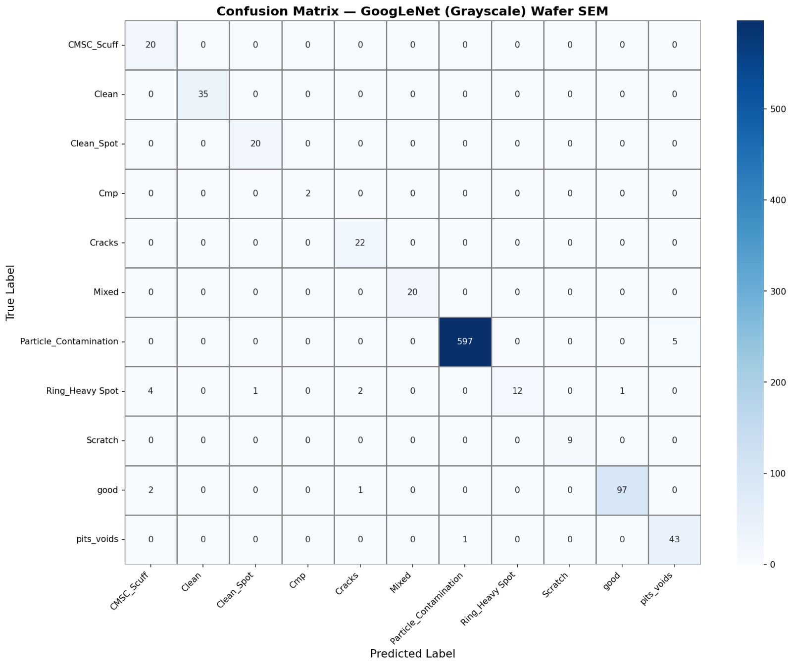
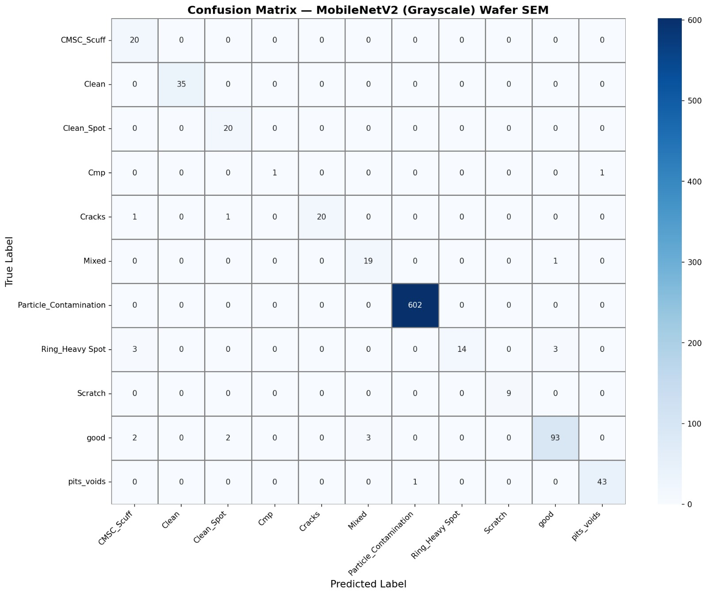
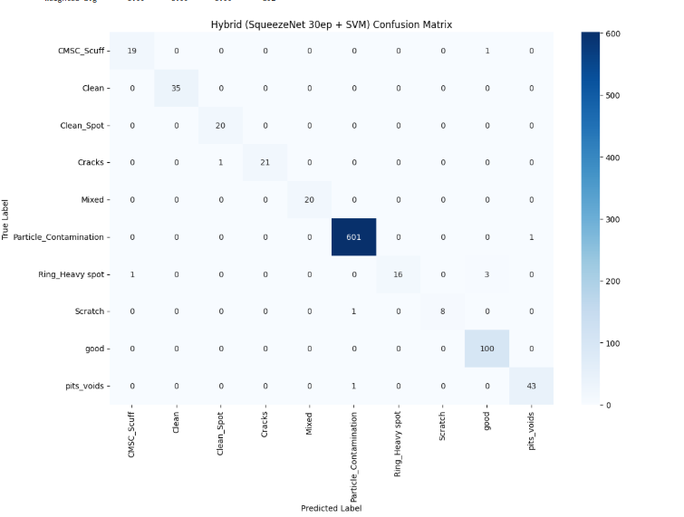

# SEM Wafer Defect Detection – Detailed Results and Analysis

This document presents a comprehensive analysis of experiments conducted for automatic classification of semiconductor wafer defects using Scanning Electron Microscope (SEM) images. Multiple deep learning architectures were evaluated under a unified preprocessing and training framework. Further optimization was performed using epoch-wise training and a hybrid CNN–SVM approach to improve classification robustness and generalization.

---

## 1. Overall Experimental Workflow

The objective of this work was to design a high-accuracy yet deployment-efficient SEM wafer defect classification system. Instead of directly optimizing a single model, a systematic multi-stage workflow was followed to ensure fairness and experimental validity.

The complete workflow consists of the following stages:

1. Initial benchmarking of multiple CNN architectures  
2. Comparative evaluation using a fixed dataset and common metrics  
3. Model selection based on accuracy–efficiency trade-off  
4. Class refinement to address imbalance  
5. Epoch-wise optimization  
6. Hybrid CNN–SVM enhancement  

This step-by-step approach ensures that the final model choice is data-driven, explainable, and experimentally justified, which is critical for hackathon evaluation.

---

## 2. Dataset and Preprocessing

The SEM wafer dataset consists of grayscale SEM images representing various wafer defect and non-defect patterns. Initially, the dataset contained 11 classes:

CMSC_Scuff, Clean, Clean_Spot, Cmp, Cracks, Mixed, Particle_Contamination, Ring_Heavy Spot, Scratch, good, and pits_voids.

All images were:

- Converted to single-channel grayscale  
- Resized to 224 × 224 pixels  
- Normalized before training  

To improve generalization and reduce overfitting, the following data augmentation techniques were applied during training:

- Horizontal and vertical flipping  
- Rotation  
- Affine transformations  
- Color jittering  

The same preprocessing and augmentation pipeline was used for all models to ensure a fair comparison.

---

## 3. Initial Model Benchmarking (11-Class Setup)

### 3.1 Models Evaluated

In the first stage, multiple state-of-the-art CNN architectures were trained and evaluated on the same 11-class dataset using identical training and evaluation settings.

The goal of this stage was not only to maximize accuracy, but also to analyze computational efficiency, architectural behavior, and deployment feasibility.

The following models were evaluated using transfer learning with ImageNet-pretrained weights adapted for grayscale input:

- AlexNet  
- EfficientNet-B0  
- MobileNetV2  
- GoogLeNet (Inception v1)  
- SqueezeNet (CNN-only)  

Weighted cross-entropy loss was used to address class imbalance, and all models were evaluated on a fixed test set.

---

### Model Performance Summary

| Model | Accuracy (%) | Key Characteristics |
|-----|-------------|-------------------|
| AlexNet | ~92.0 | Older architecture, large parameter count, lower generalization |
| EfficientNet-B0 | ~98.0 | High accuracy, compound scaling, computationally heavier |
| MobileNetV2 | 97.99 | Lightweight, fast inference, mobile-friendly |
| GoogLeNet | 98.10 | Strong feature extraction, higher architectural complexity |
| SqueezeNet (CNN-only) | 95.97 | Extremely small model, lowest parameter count |

---

### 3.3 Observations

- AlexNet achieved the lowest accuracy due to its outdated architecture, making it unsuitable for fine-grained SEM defect classification.  

- EfficientNet-B0 achieved high accuracy but required higher computational resources, limiting its suitability for edge or real-time deployment.  

- GoogLeNet provided the best pure CNN accuracy but at the cost of increased complexity.  

- MobileNetV2 demonstrated an excellent balance between accuracy and inference speed.  

- SqueezeNet, although slightly lower in baseline accuracy, stood out due to its extreme parameter efficiency and very low memory footprint, making it an ideal candidate for further optimization.
- ---

## 4. Rationale for Selecting SqueezeNet

Rather than selecting the model with the highest raw accuracy, SqueezeNet was chosen for refinement based on engineering-driven considerations:

- Very low parameter count (deployment-friendly)  
- Faster inference compared to deeper CNNs  
- Fire module architecture enables efficient feature reuse  
- Suitable for edge devices and real-time inspection systems  
- Performance gap could potentially be closed through optimization  

Thus, SqueezeNet was selected as the base architecture, not the final model at this stage.

---

## 5. Class Refinement and Epoch-wise SqueezeNet Training (10 Classes)

During further experimentation, the ‘cmp’ class was removed from the dataset, reducing the total number of classes from 11 to 10. This class contained very few samples and caused instability in validation accuracy due to severe class imbalance. Removing this class resulted in more stable convergence and improved generalization.

### Epoch-wise Performance

| Model | Epochs | Classes | Test Accuracy (%) |
|-----|-------|--------|------------------|
| SqueezeNet | 20 | 10 | 98.54 |
| SqueezeNet | 30 | 10 | 98.99 |
| SqueezeNet | 50 | 10 | 98.09 |

The 30-epoch SqueezeNet model achieved the highest accuracy, indicating optimal training duration. Lower epoch counts resulted in underfitting, while higher epoch counts led to mild overfitting.

---

## 7. Hybrid SqueezeNet + SVM Enhancement

To further improve classification robustness, the softmax classifier of the optimized SqueezeNet (30 epochs) was replaced with a Support Vector Machine (SVM). In this hybrid architecture:

- SqueezeNet acts as a fixed deep feature extractor  
- The SVM performs final classification using margin-based decision boundaries  

### Why SVM?

- Better margin maximization  
- Stronger decision boundaries in high-dimensional feature space  
- Improved handling of visually overlapping defect classes  

### Hybrid Model Performance

| Accuracy (%) | Precision (%) | Recall (%) | F1-score (%) | MCC | Classes |
|-------------|--------------|------------|--------------|-----|--------|
| 98.99 | ≈99 | ≈99 | ≈99 | ≈0.99 | 10 |

This hybrid approach successfully closes the performance gap between compact and heavy CNN models.

---

## 6. Confusion Matrix Analysis

Confusion matrix analysis reveals strong diagonal dominance for both GoogLeNet and the hybrid SqueezeNet + SVM model, indicating correct classification for the majority of samples.

Minor misclassifications were observed mainly between visually similar defect classes such as **CMSC_Scuff**, **Clean_Spot**, and **Cracks**.

**Particle_Contamination**, being the dominant class, was classified with near-perfect precision and recall across all models.
---

## 7. Confusion Matrix Visual Analysis

### 7.1 Confusion Matrix for Baseline CNN Models

The confusion matrices of the baseline CNN models (MobileNetV2, GoogLeNet, and CNN-only SqueezeNet) show a strong dominance along the main diagonal, indicating that the majority of samples are correctly classified. This confirms that the models successfully learn discriminative spatial features from SEM images.

However, minor misclassifications are observed between visually similar defect categories, such as:

- CMSC_Scuff and Clean_Spot  
- Cracks and Mixed  
- good and minor surface defect classes  

These errors are expected in SEM-based inspection due to subtle texture variations and overlapping morphological characteristics between certain defect types.

The **Particle_Contamination** class exhibits near-perfect classification across all baseline models, primarily due to its larger sample size and distinct visual features, resulting in very high precision and recall.

---

### 7.2 Confusion Matrix for Hybrid SqueezeNet + SVM Model

The confusion matrix of the hybrid SqueezeNet + SVM model shows the strongest diagonal dominance among all evaluated approaches, indicating near-perfect classification performance across the 10 defect classes.

Compared to softmax-based classifiers, the SVM improves decision boundaries in the high-dimensional feature space, leading to:

- Further reduction in inter-class confusion  
- Improved robustness for visually overlapping defect types  
- Consistent performance across both majority and minority classes  

Only a negligible number of misclassifications are observed, confirming that the hybrid approach effectively enhances feature discrimination while maintaining computational efficiency.

